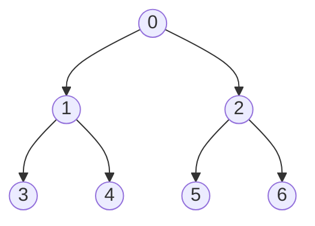

Heap is a binary tree with the max/min among its children value in its root,  and also, for all of its child tree, their root also is the max/min among their child tree.

`Heapify(heap, i):` For node $i$, keep $i$ is maintain order compare to its children

`Insert(heap, i):` insert $i$ and compare it to its parent to keep order

`Extract(heap):` return the max/min value

`HeapSort(heap):` return a sorted list

## Implement

We use array to implement heap, named it $arr$, but think it as binary tree, where for the $i$ node, the parent of this node is $arr[\lfloor (i - 1)/2\rfloor]$, the left node is $arr[2(i + 1) - 1]$ and the right node $arr[2(i+1)]$. In 1-index, it will be change into: the parent of this node is $arr[\lfloor i/2\rfloor]$, the left node is $arr[2i]$ and the right node $arr[2i + 1]$

-   e.g. $[0, 1,2,3,4,5,6]$
-   the parent of 1 and 2 is the node 0 (i.e. (2-1)/2 = 0, (1-1)/2 = 0); same for 3,4 (i.e. (3-1)/2 = 1 = (4-1)/2 = 1)
-   the left node of 1 is $arr[3]$ and right node is $arr[4]$



To **heapify** a specific node $i$:  we compare i and its two children node, find the larger/lower base on the (min heap/max heap)  switch and keep tracking the lower level 

To **insert** a value: we first insert at the end and compare with its parent and recursive to do it 'till can't.

To **extractMax/extractMin**: we first switch the first node value and last node's value and then do the heapify operation. (Notice, method may different from different instructor, some of them may more like **move forward last to first** instead of swap, that is, when they ask the number of times swap it will less 1 than swap first & last.)

Priority Queue is a maxheap.

---

For a given array, we need to use heapify every parent node to make it heap.

We can use a heapified array to do **heap sort**, where we use the property max/min and switch it with the last element and then heapify to keep heap work.


example code for ez version maxheap:

```c++
vector<int> maxh;
mh.push_back(INT_MIN); // insert a trash value so that we can start from 1 which make life easier :)
void heapify(vector<int>& heap, int root){
    // check if root is the last
    int n = heap.size() - 1;
    if (root == n) return; // Since in the end, we have nothing to compare which shows the max order maintain
    int maxchild = root; // the term we will return; if no child or order already maintain, then we stay
    int left = 2 * root, right = left + 1;
    if (left < n && heap[root] < heap[left]) maxchild = left;
    if (right < n && heap[maxchild] < heap[right]) maxchild = right;
    if (maxchild == root) return; // order maintain then we go
    swap(heap[root], heap[maxchild]); // exist bigger, then we switch then continue heapify
    heapify(heap, maxchild);
}// log n

void insert(vector<int>& heap, int x){
    heap.push_back(x);
    int n = heap.size() - 1;
    int parent = (n&1)? (n-1)/2: n/2;
    while(parent != 0 && heap[parent] < heap[n]){
        swap(heap[parent], heap[n]);
        n = parent;
        parent = (n&1)? (n-1)/2: n/2;
    }
}// logn

int extractMax(vector<int>& heap){
    int n = heap.size() - 1;
    swap(heap[n], heap[1]);
    int rst = heap[n];
    heap.pop_back();
    heapify(heap, 1);
    return rst;
}// logn

vector<int> heapsort(vector<int>& heap){
    vector<int> rst;
    while(heap.size() != 1) rst.push_back(extractMax(heap));
    return rst;
}// nlogn in reverse order;

// given a unknown list, assume this list idx 0 contain a trash
vector<int> heapsort(vector<int>& unknown){
    vector<int> rst;
    int start = 1. n = unknown.size() - 1;
    while(n >= 1){
        int parent = (n&1)? (n-1)/2: n/2;
        heapify(unknown, parent);
        n--;
    }
    while(heap.size() != 1) rst.push_back(extractMax(unknown));
    return rst;
} // nlogn + nlogn in reverse order;
```

