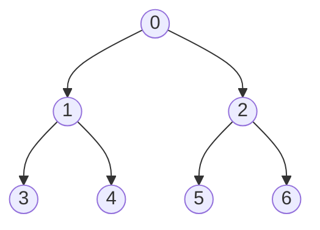

We use array to implement heap, named it $arr$, but think it as binary tree, where for the $i$ node, the parent of this node is $arr[\lfloor (i - 1)/2\rfloor]$, the left node is $arr[2(i + 1) - 1]$ and the right node $arr[2(i+1)]$. In 1-index, it will be change into: the parent of this node is $arr[\lfloor i/2\rfloor]$, the left node is $arr[2i]$ and the right node $arr[2i + 1]$

-   e.g. $[0, 1,2,3,4,5,6]$
-   the parent of 1 and 2 is the node 0 (i.e. (2-1)/2 = 0, (1-1)/2 = 0); same for 3,4 (i.e. (3-1)/2 = 1 = (4-1)/2 = 1)
-   the left node of 1 is $arr[3]$ and right node is $arr[4]$

To heapify a specific node $i$:  we compare the root and its two children node, find the larger/lower base on the (min heap/max heap)  switch and keep tracking the lower level

To insert a value: we first insert at the end and compare with its parent and recursive to do it 'till can't.

To extractMax/extractMin: we first switch the first node value and last node's value and then do the heapify operation.

Priority Queue is a maxheap.

---

For a given array, we need to use heapify every parent node to make it heap.

We can use a heapified array to do heap sort, where we use the property max/min and switch it with the last element and then heapify to keep heap work.