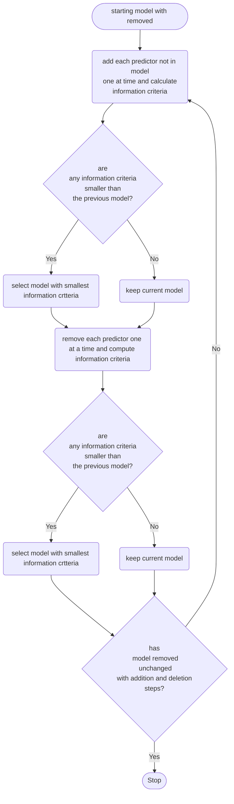

# Module 9

In this module, we mainly talk about "efficient" ways that find theoretical "best fit" model. Specifically, we talk about model selection methods.

In this module, two kind of selection methods discussed:

-   All Possible Subsets Selection
-   Step Selection

## All Possible Subsets Selection

Just as the name, we will find all nonempty subsets of models and use the knowledge from last few weeks to find out if the model best fit.

Concretely, we do:

1.   fix the number of predictors from 1 and classify subset in various group

2.    compare elements in each group and pick the one with the highest **adjective coefficient of determination $R^2$**  value
3.    use 4 criteria(AIC, corrected AIC, BIC, $R_{ajd}^2$) to determine which is the "best"
     -   should have the largest $R_{ajd}^2$ and smallest AIC, corrected AIC, BIC

Since it‘s too "absolute", it may result in models contain more predictors than needed. Thus, we will use the smallest "largest $R_{ajd}^2$" and bigger "smallest AIC, corrected AIC, BIC" or the AIC, corrected AIC, BIC with smallest difference.

## Step Selection

Similarly, step selection implement by step and has 3 different implements, and may result in different models.

### Forward Selection

Start with no predictors and then add one predictors at one time until has the lowest information criterion (add one more will increase/ no more to add)

Step:

1.   find the 1 predictor model with smallest AIC/BIC
2.   add 1 predictor and find the one with smallest AIC/BIC. If exists continue this step, else end
     -   add the predictor from smallest AIC/BIC model  is same as add predictor with smallest p-value for its t-test

### Backward Selection/Elimination

Opposite of the forward, backward elimination start with all predictors and deletes one predictor at one time until has the lowest information criterion (delete one more will increase/ no more to delete)

Step:

1.   find the all predictors model with smallest AIC/BIC
2.   delete 1 predictor and find the one with smallest AIC/BIC. If exists continue this step, else end
     -   delete the predictor from smallest AIC/BIC model  is same as delete predictor with largest p-value

### Stepwise Selection

Combine both forward and backward selection, start with a selected model, then do addition step or delete step to find the "best" and then do the opposite step to find the "best", continue until no more such "best" exist.

a diagram start with delete as below

#### Difference of two kinds of selection methods:

All Possible Subsets Selection:

-   fit $2^p$ models as the name all possible subsets, $p$ is the total number of predictor

Step Selection:

-   fit $p(p+1)/2$ models, get from $p + (p-1) + (p -2 )+ \dots+1$
-   may not get the best model since it only operates in one direction

## Cons and Pros

Advantage of selection method:

-   a systematic way to select a model from a large set of predictors
    -   we say systematic means that easy to document and reproducible 
-   give an idea about a preferred model

Disadvantage:

-   If model is not satisfied the assumption, selection method still work
-   If model with multicollinearity, selection method still work
-   Totally theoretical, can not combine with any literature or context or the area we interest
-   each selection may result on different model, then which one is the preferred

## Conclusion 

As we see in [Cons and Pros](#Cons and Pros) section, we must be cautioned when use the selection methods.

It may also raise Bias:

>   In a paper by Loeb and Potscher (2005), they discuss how the estimated coefficients from a model arising from an automated selection procedure will actually be biased, and that p-values will tend to be smaller.

If it is not necessary to use selection method, then do not use. If use those, then we must describe why we should use and the problem it may raise.
