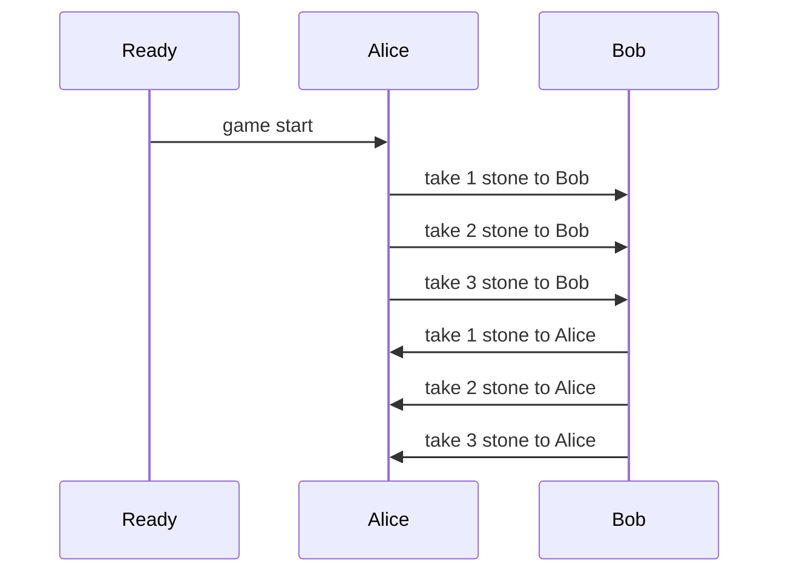

博弈论dp， 收藏了两个帖子[1](https://blog.csdn.net/acm_cxlove/article/details/7854530) , [2](https://blog.csdn.net/acm_cxlove/article/details/7854526)

下图展示state

## 错误的想法

开始设想`dp[i][j]`表示第`i`个石头时，`j`所表达最大的可以take的数量

在`i`的情况下，`j = 0` 只能分别从拿1,2,3个石头前的 `j = 1`来 反之亦然， 

我刚开始想的是既然是从前面1,2,3来的，那么只能继承(1,2,3) - 1的位置来的相同`j`. 可这样是错的, 最简单的设想`i = 1`， alice 往前找1,2,3 这可能吗？不可能, `i = 1`只能bob先找或者alice继承`i=0`根本无法顺序从头遍历
### 从后往前遍历

从后往前遍历就无法得到之前的1,2,3了，这样的情况只能以当前为起点往后选。但这样引起了新的问题，例如目前在`i`位，我们知道`dp[i+1][j]`也是之后的1,2,3。这样也不可以

## 先手/后手

看完题解以后才意识到自己陷入了误区, 因为state是连着的而我分开了`j`，这意味着我根本没有办法连贯信息，将`j = 0` 是alice 和 `j = 1`是bob这个想法摈弃。现在将`j = 0` 看成是先手 和 `j = 1`看成是后手，我们发现无法在最后也就是`dp[n]`时看出谁是先手谁是后手所以，我们从后往前遍历到`dp[0]` 从而可以确定先手是alice后手是bob
### 从后往前遍历

因为`j`现在是先后手拿东西，这也意味着现在先手拿`k`个东西, 那么在`dp[i+k]`时就要后手那东西

这样我们可以得到`dp[i][j] = max(dp[i+1][!j] + sum(stone[i]), dp[i+2][!j] + sum(stone[i:i+1]), dp[i+3][!j] + sum(stone[i:i+2]))`，因为先手可以先选所以我们取`j=0` 然后根据先手的值来更新后手最大值 (i.e. 如果 `dp[i][0] = dp[i+1][1] + stone[i]`, 那么`dp[i][1] = dp[i+1][0]`)

### 压缩

我们不难发现实际上我们更新中只看一个值，不如将两个值结合在一起:  `dp[i]` 表达从`i`开始的先手-后手最大值，这也意味着对于`i-1`来说如果它先手拿一个石头，则`i` 是后手变先手。
也就是说`dp[i] = max(dp[i], sum(stone[i:i+1]) - dp[i+1], sum(stone[i:i+2]) - dp[i+2], sum(stone[i:i+3]) - dp[i+3])`